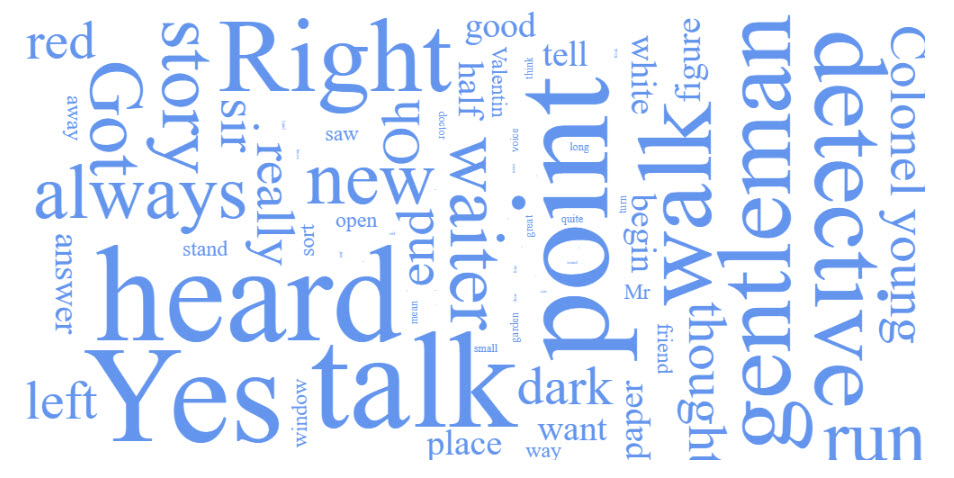

# Sparc.TagCloud.Core - A TagCloud library for .NET Core

This library is a port of the original [Sparc.TagCloud](https://github.com/chrisdavies/Sparc.TagCloud) to .NET Core which was written by [Chris Davies](https://github.com/chrisdavies).

The web example has been updated to use [ASP.Net Core Razor Pages](https://docs.microsoft.com/en-us/aspnet/core/razor-pages/?view=aspnetcore-3.1&tabs=visual-studio) and the [wordcloud2.js](https://wordcloud2-js.timdream.org/) from [Tim Dream](https://timdream.org/).




Chris' original readme is as follows:

---------------

# Sparc.TagCloud - A TagCloud library for .NET
The TagCloud library is a simple tag-cloud library for .NET.  It consumes a set of strings and produces a set of tag objects.  Each tag object contains the tag's text or phrase, the number of times that phrase occurred inside of the set of strings, and the tag's category.

## Lemmatizer
This library uses the wonderful LemmaGen library to lemmatize the analyzed text.  This means that words will be reduced to their bases (e.g. "cat" and "cats") will show up in the tag-cloud simply as "cat".  (The LemmaGen library can be found here: http://lemmatise.ijs.si/Software/Version3).

## Tag Categories
The category is simply a mechanism for grouping tags.  The library defaults to 10 category types.  So, given a set of 100 words, the 10 most frequently occuring would be category 0.  The next 10 most frequently occuring words would be category 1, etc.  This categorization allows one to easily cluster tags for a nice visual effect.  (See the ASP.NET MVC example.)

## Examples
Below is a simple code example that analyzes a set of blogposts and returns a tag-cloud.


```csharp
var analyzer = new TagCloudAnalyzer();

// blogPosts is an IEnumerable<String>, loaded from
// the database or whatevz.
var tags = analyzer.ComputeTagCloud(blogPosts);

// Shuffle the tags, if you like for a random
// display
tags = tags.Shuffle();

```

For more examples, including rendering a tag-cloud using ASP.NET MVC, look at the Examples folder in the source.


Image source: http://www.flickr.com/photos/89428839@N00/5944228035/

## License MIT

Copyright (c) 2017 Chris Davies

Permission is hereby granted, free of charge, to any person obtaining a copy of this software and associated documentation files (the "Software"), to deal in the Software without restriction, including without limitation the rights to use, copy, modify, merge, publish, distribute, sublicense, and/or sell copies of the Software, and to permit persons to whom the Software is furnished to do so, subject to the following conditions:

The above copyright notice and this permission notice shall be included in all copies or substantial portions of the Software.

THE SOFTWARE IS PROVIDED "AS IS", WITHOUT WARRANTY OF ANY KIND, EXPRESS OR IMPLIED, INCLUDING BUT NOT LIMITED TO THE WARRANTIES OF MERCHANTABILITY, FITNESS FOR A PARTICULAR PURPOSE AND NONINFRINGEMENT. IN NO EVENT SHALL THE AUTHORS OR COPYRIGHT HOLDERS BE LIABLE FOR ANY CLAIM, DAMAGES OR OTHER LIABILITY, WHETHER IN AN ACTION OF CONTRACT, TORT OR OTHERWISE, ARISING FROM, OUT OF OR IN CONNECTION WITH THE SOFTWARE OR THE USE OR OTHER DEALINGS IN THE SOFTWARE.
